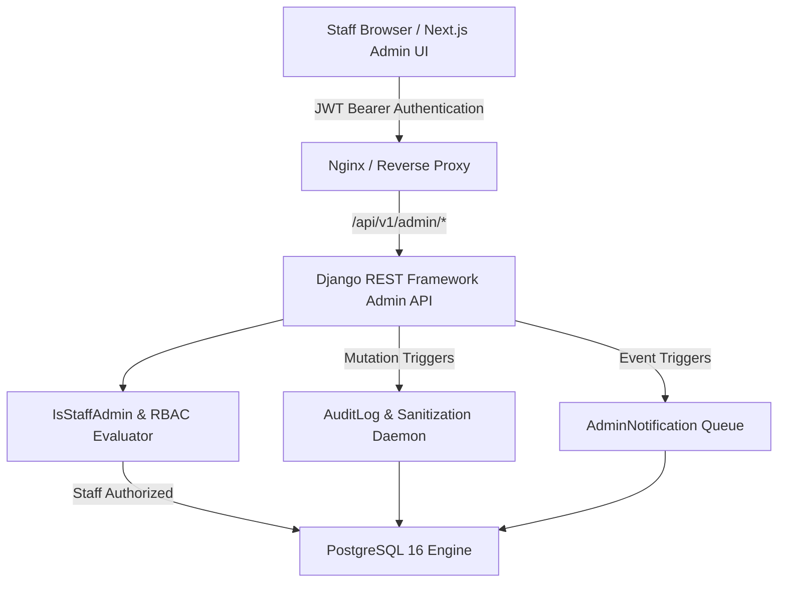

# Paradox Control Center — Architecture & Technical Blueprint

## 1. Executive Summary

The **Paradox Control Center** is a secure, database-backed, real-time administrative operations platform built for Paradox Shop. It replaces mock/static dashboard interfaces with an end-to-end operational control layer supporting high-value horological and engineered luxury goods commerce.

---

## 2. System Architecture

---

## 3. Core Architectural Tenets

### 3.1 Strict Zero-Mock Principle
- **No synthetic mock fallbacks**: All telemetry, tables, charts, and metrics query live PostgreSQL relations.
- **Authoritative Server Aggregations**: Financial indicators ($AOV$, $CAC$, refund rate, revenue timeseries) are calculated on-the-fly via PostgreSQL ORM aggregations (`Sum`, `Count`, `Avg`, `TruncDay`, `TruncMonth`), preventing client-side drift.

### 3.2 Granular RBAC & Security Boundaries
- **JWT Staff Authentication**: Requires active user account with `is_staff=True` or `is_superuser=True`.
- **Dynamic Capability Matrix**: Evaluates granular capabilities (e.g. `orders.view`, `orders.update`, `products.create`, `inventory.update`, `settings.manage`) with domain wildcard support (`products.*`).
- **Cryptographic Audit Trail**: Every mutating administrative operation logs an immutable record with redacted sensitive data (passwords, tokens, credentials).

### 3.3 State Machine & Atomic Concurrency
- **Order Lifecycle Validation**: Enforces valid state transitions:
  $$\text{PENDING} \rightarrow \text{PROCESSING} \rightarrow \text{SHIPPED} \rightarrow \text{DELIVERED} \rightarrow \text{REFUNDED}$$
  $$\text{PENDING} \rightarrow \text{CANCELLED}, \quad \text{PROCESSING} \rightarrow \text{CANCELLED}$$
- **Atomic Stock Restoration**: Cancelling an order runs within an atomic database transaction (`transaction.atomic`) with `select_for_update()`, safely restoring reserved variant SKU stock counts and preventing race conditions.

---

## 4. Frontend Architecture & Data Flow

- **Next.js 14 App Router**: Clean sub-routes under `/admin/*` protected by `AdminAuthGuard`.
- **TanStack React Query v5**: Authoritative server-state management with structured cache keys (`['admin', domain, params]`), automatic cache invalidation upon mutations, and background polling for real-time notifications.
- **Zustand UI Stores**: Separated client UI state (theme, sidebar collapse, command palette open state).
- **Impossible Minimalism Design**: High-contrast, technical, calm, dark mode first typography and layouts using bespoke SVG charts and Lucide iconography.
