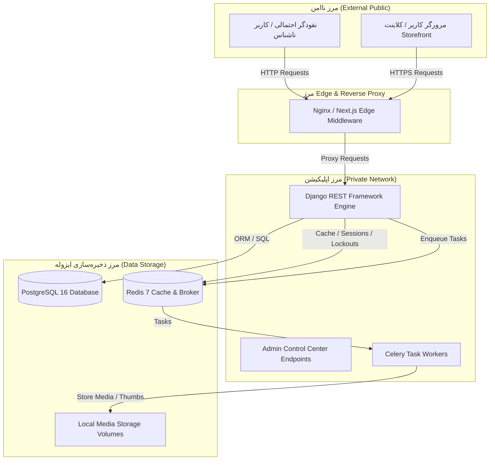

# مدل جامع تهدیدات امنیتی پارادوکس شاپ (Security Threat Model)

> **فاز**: 4.5 — Security & Production Hardening  
> **روش‌شناسی**: STRIDE (Spoofing, Tampering, Repudiation, Information Disclosure, Denial of Service, Elevation of Privilege)  
> **وضعیت**: نهایی و اعمال‌شده در سورس‌کد و پیکربندی  

---

## ۱. دارایی‌های حیاتی (Assets Inventory)

1. **اعتبارنامه‌ها و هویت کاربران**: کلمه‌های عبور (هش‌شده با Argon2/PBKDF2)، توکن‌های دسترسی و نوسازی JWT، کدهای یک‌بارمصرف (OTP).
2. **اطلاعات مالی و سفارشات**: موجودی انبار، سوابق فاکتورها و اقلام سفارش، کدهای تخفیف و کوپن‌های نقدی، تراکنش‌های بانکی/درگاه پرداخت.
3. **داده‌های خصوصی کاربران (PII)**: شماره تلفن همراه، آدرس‌های فیزیکی پستی، نام و مشخصات هویتی.
4. **داده‌های تولیدی و محتوای فروشگاه**: محصولات، دسته‌بندی‌ها، نظرات، پرسش و پاسخ‌ها، تصاویر ارسالی خریداران.
5. **کلیدهای محرمانه و زیرساخت**: `DJANGO_SECRET_KEY`، رمز عبور پایگاه داده PostgreSQL، کانتینرهای سرویس‌دهنده، شبکه‌های مجزای Docker.

---

## ۲. مرزهای اعتماد (Trust Boundaries)

1. **مرز کلاینت به Edge**: تبادل درخواست‌ها بین کلاینت وب (Next.js) و سرور بک‌اند؛ درخواست‌ها غیرقابل اعتماد فرض می‌شوند.
2. **مرز احراز هویت ادمین**: کنترل دسترسی بین کاربران عادی واردشده و پرسنل صاحب صلاحیت ادمین با سطوح اختیار اختصاصی.
3. **مرز پردازشگرهای ناهمگام**: ورودی‌های صف Celery که توسط ورکرها از ردیس خوانده شده و پردازش می‌شوند.
4. **مرز رسانه‌ها و فایل‌ها**: فایل‌های چندرسانه‌ای بارگذاری‌شده توسط کاربران قبل از رسیدن به فضای دیسک و پردازش با Pillow.

---

## ۳. مهاجمان بالقوه (Adversary Profiles)

| نوع مهاجم | انگیزه | سطح دسترسی اولیه | بردارهای حمله |
| :--- | :--- | :--- | :--- |
| **مهاجم بیرونی فرصت‌طلب** | سرقت کدهای OTP، حدس اعتبارنامه‌ها، باج‌گیری | ناشناس (Anonymous) | حملات Brute-Force، اسکن آسیب‌پذیری‌های وب، دستکاری URL |
| **مشتری مخرب (Malicious Patron)** | دسترسی به سفارشات دیگران، اعمال تخفیف غیرمجاز | احراز هویت‌شده عادی | حملات IDOR، Race Condition در خرید و کوپن، تزریق اسکریپت در نظرات |
| **کارمند با اختیارات محدود** | نفوذ به بخش‌های ادمین فراتر از اختیارات | پرسنل با دسترسی محدود | ترفیع افقی/عمودی دسترسی (Privilege Escalation) |
| **ربات‌های مخرب (Scrapers & Bots)** | ایجاد محرومیت از سرویس (DoS)، بمباران OTP | ناشناس با IPهای متعدد | ارسال مکرر درخواست، بارگذاری تصاویر مخرب (Decompression Bombs) |

---

## ۴. ماتریس تهدیدات مبتنی بر STRIDE و ارزیابی ریسک

### ۴.۱. جعل هویت (Spoofing)

* **تهدید S1: تلاش برای حدس کد OTP تایید ایمیل و بازیابی رمز عبور**
  * *طبقه‌بندی شدت*: `HIGH`
  * *بردار*: ارسال انبوه کدهای ۶ رقمی برای یک کاربر خاص.
  * *راهکار کاهشی (Mitigation)*: سیستم قفل قطعی پس از ۵ بار تلاش ناموفق؛ حذف فوری کد از ردیس و باطل‌سازی سشن؛ محدودسازی نرخ در لایه DRF ScopedThrottle به ۱۰ درخواست در دقیقه.
* **تهدید S2: ارسال درخواست با Origin نامعتبر در پروداکشن (CORS Spoofing)**
  * *طبقه‌بندی شدت*: `MEDIUM`
  * *بردار*: ارسال درخواست API از دامنه‌های غیرمجاز از طریق مرورگر قربانی.
  * *راهکار کاهشی*: غیرفعال‌سازی قطعی `CORS_ALLOW_ALL_ORIGINS = False` در `base.py` و `production.py`؛ الزام اعتبارسنجی دامنه در `CORS_ALLOWED_ORIGINS`.

---

### ۴.۲. دستکاری داده‌ها (Tampering)

* **تهدید T1: دستکاری پارامترهای تغییر سفارش یا فاکتور کاربر دیگر (IDOR)**
  * *طبقه‌بندی شدت*: `CRITICAL`
  * *بردار*: تغییر UUID سفارش در اندپوینت `api/v1/orders/<uuid>/`.
  * *راهکار کاهشی*: الزام کوئری در سطح مالک (`OrderSelector.get_order_detail(order_id, user=request.user)`) همراه با پرمیشن کلاس `IsOrderOwner`. بازگرداندن خطای ۴۰۴ در صورت عدم تطابق مالکیت.
* **تهدید T2: اعمال کوپن تخفیف همزمان در چندین سبد خرید (Race Condition)**
  * *طبقه‌بندی شدت*: `HIGH`
  * *بردار*: ارسال همزمان چندین درخواست پرداخت با یک کد تخفیف یک‌بارمصرف.
  * *راهکار کاهشی*: قفل‌گذاری سطری بدنه پایگاه داده با `select_for_update()` در متدهای ثبت سفارش و کوپن، همراه با تراکنش‌های اتمیک `@transaction.atomic`.
* **تهدید T3: دستکاری پارامتر Redirect در صفحه لاگین (Open Redirect - CWE-601)**
  * *طبقه‌بندی شدت*: `MEDIUM`
  * *بردار*: فریب کاربر برای کلیک روی `/login?redirect=https://phishing.site`.
  * *راهکار کاهشی*: پیاده‌سازی متد `getSafeRedirectUrl` در فرانت‌اند؛ پذیرش صرفاً مسیرهای نسبی که با تک‌اسلش شروع شده و فاقد `//` یا کاراکترهای اسکیپ هستند.

---

### ۴.۳. انکارناپذیری (Repudiation)

* **تهدید R1: انکار اقدامات مدیریتی در پنل ادمین**
  * *طبقه‌بندی شدت*: `MEDIUM`
  * *بردار*: کارمند ادمین سفارشی را لغو کرده یا نظری را حذف کند و ادعای بی‌اطلاعی نماید.
  * *راهکار کاهشی*: ثبت خودکار لاگ‌های حسابرسی جامع در جدول `AuditLog` با متد `record_audit_log` شامل شناسنامه اقدام، شناسه کاربر، IP و اطلاعات درخواست.

---

### ۴.۴. افشای اطلاعات (Information Disclosure)

* **تهدید I1: افشای وجود حساب‌های کاربری در صفحه فراموشی رمز عبور (User Enumeration)**
  * *طبقه‌بندی شدت*: `MEDIUM`
  * *بردار*: ارسال ایمیل‌های مختلف و بررسی تفاوت کد وضعیت یا پیام خطا.
  * *راهکار کاهشی*: بازگرداندن پاسخ یکنواخت و کد وضعیت ۲۰۰ با پیام مبهم یکسان: `"If your email is registered, a password reset code has been dispatched."` بدون توجه به وجود یا عدم وجود کاربر.
* **تهدید I2: افشای توکن‌ها و پسوردها در لاگ‌های سیستمی پروداکشن**
  * *طبقه‌بندی شدت*: `HIGH`
  * *بردار*: نوشتن دیکشنری‌های لاگ در فایل‌ها یا سرویس‌های جمع‌آوری لاگ.
  * *راهکار کاهشی*: اعمال فیلتر `SensitiveDataFilter` در پیکربندی لاگر جنگو جهت ماسک‌گذاری خودکار کلمات کلیدی `password`, `token`, `secret`, `authorization`, `cookie`. مخفی‌سازی کدهای OTP در لاگ هنگام `DEBUG=False`.
* **تهدید I3: نشت پیام‌های خطای خام پایگاه داده به کلاینت (Stack Trace Leaks)**
  * *طبقه‌بندی شدت*: `HIGH`
  * *بردار*: ایجاد خطاهای غیرمنتظره و ۵۰۰ برای استخراج معماری دیتابیس.
  * *راهکار کاهشی*: پیاده‌سازی `custom_exception_handler` که خطاهای مدیریت‌نشده را به ساختار امن `InternalServerError` بدون جزییات فنی تبدیل می‌کند.

---

### ۴.۵. محرومیت از سرویس (Denial of Service)

* **تهدید D1: حملات Decompression Bomb و بارگذاری فایل‌های حجیم**
  * *طبقه‌بندی شدت*: `HIGH`
  * *بردار*: آپلود فایل فشرده تصویری با رزولوشن میلیونی که رم سرور را پر کند.
  * *راهکار کاهشی*: محدودسازی `Image.MAX_IMAGE_PIXELS = 10_000_000` در Pillow؛ بررسی ابعاد قبل از دیکود کامل تصویر (حداکثر ۴۰۹۶ در ۴۰۹۶ پیکسل)؛ سقف حجم فایل حداکثر ۵ مگابایت؛ محدودسازی حجم آپلود کل در تنظیمات جنگو به ۱۰ مگابایت.
* **تهدید D2: بمباران درخواست‌های لاگین و OTP (Authentication Flooding)**
  * *طبقه‌بندی شدت*: `MEDIUM`
  * *بردار*: ارسال مداوم درخواست‌های ورود به سیستم.
  * *راهکار کاهشی*: فعال‌سازی Scoped Throttle به ازای هر IP (ورود: ۱۰ بار در دقیقه، ثبت‌نام: ۵ بار در دقیقه، ارسال OTP: ۱۰ بار در دقیقه).

---

### ۴.۶. ترفیع دسترسی (Elevation of Privilege)

* **تهدید E1: دسترسی مستقیم به اندپوینت‌های ادمین توسط مشتری عادی**
  * *طبقه‌بندی شدت*: `CRITICAL`
  * *بردار*: دور زدن گارد فرانت‌اند و ارسال درخواست مستقیم به `/api/v1/admin/*`.
  * *راهکار کاهشی*: اجبار استفاده از `permission_classes = [IsStaffAdmin]` و `IsPromotionAdmin` روی تمام اندپوینت‌های ماژول ادمین بک‌اند؛ بررسی پرچم‌های `is_staff` و `is_superuser` در سمت سرور.
* **تهدید E2: استفاده مجدد از رفرش‌توکن سرقت‌شده پس از خروج (Token Replay)**
  * *طبقه‌بندی شدت*: `HIGH`
  * *بردار*: استفاده از توکن رفرش قدیمی پس از لاگ‌اوت کاربر.
  * *راهکار کاهشی*: استفاده از `rest_framework_simplejwt.token_blacklist`؛ ثبت توکن در جدول بلک‌لیست در متد خروج و مسدودسازی آن در کلیه درخواست‌های آتی نوسازی.

---

## ۵. خلاصه ماتریس کنترل‌های امنیتی و وضعیت نهایی

| کد تهدید | طبقه‌بندی STRIDE | سطح ریسک اولیه | کنترل امنیتی اعمال‌شده | وضعیت پس از فاز 4.5 |
| :--- | :--- | :---: | :--- | :---: |
| **S1** | Spoofing | HIGH | قفل ۵ مرحله‌ای OTP + ابطال کلید ردیس + Rate Throttling | **FIXED** |
| **S2** | Spoofing | MEDIUM | قفل سراسری CORS + تفکیک محیطی توسعه و پروداکشن | **FIXED** |
| **T1** | Tampering | CRITICAL | فیلتر کوئری در سطح مالک + `IsOrderOwner` / `IsPaymentOwner` / `IsOwner` | **VERIFIED SAFE** |
| **T2** | Tampering | HIGH | تراکنش‌های اتمیک + قفل ردیفی دیتابیس با `select_for_update` | **VERIFIED SAFE** |
| **T3** | Tampering | MEDIUM | اعتبارسنجی آدرس‌های بازگشتی با `getSafeRedirectUrl` | **FIXED** |
| **R1** | Repudiation | MEDIUM | ثبت لاگ‌های حسابرسی ادمین در `AuditLog` | **VERIFIED SAFE** |
| **I1** | Information Disclosure | MEDIUM | پاسخ همسان و مبهم در بازیابی رمز عبور | **FIXED** |
| **I2** | Information Disclosure | HIGH | فیلتر داده‌های حساس `SensitiveDataFilter` + پنهان‌سازی لاگ OTP | **FIXED** |
| **I3** | Information Disclosure | HIGH | هندلر خطای استاندارد و عدم نشت Stack Trace | **FIXED** |
| **D1** | Denial of Service | HIGH | محدودسازی ابعاد، پسوند و حجم تصویر + کنترل Decompression Bomb | **FIXED** |
| **D2** | Denial of Service | MEDIUM | اعمال ScopedRateThrottle روی لاگین، ثبت‌نام و OTP | **FIXED** |
| **E1** | Elevation of Privilege | CRITICAL | استقرار `IsStaffAdmin` و `IsPromotionAdmin` روی تمام ۴۸ اندپوینت | **VERIFIED SAFE** |
| **E2** | Elevation of Privilege | HIGH | توکن بلک‌لیست جنگو و چرخش اجباری رفرش‌توکن | **VERIFIED SAFE** |
