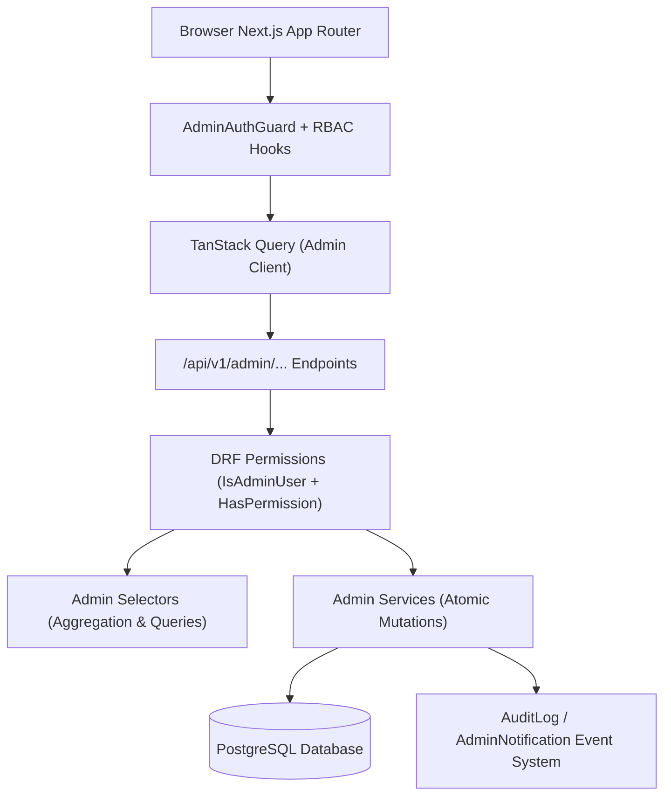

# PARADOX CONTROL CENTER — COMPREHENSIVE ARCHITECTURE & IMPLEMENTATION PLAN

## Executive Summary

The **Paradox Control Center** is the unified administrative command platform for **Paradox Shop**, providing secure, database-backed, permission-aware operations across orders, catalog, inventory, patrons, reviews, payments, analytics, notifications, and immutable audit logs.

This plan details the full transition from the initial frontend prototype (which contained mock data, static chart datasets, and localStorage fallbacks) to a **100% real, PostgreSQL-backed, secure DRF + Next.js App Router administration system**.

---

## User Review Required

> [!IMPORTANT]
> **Zero-Tolerance for Mock/Fake Data**: All localStorage fallbacks, hardcoded KPI counters, and synthetic chart arrays in `frontend/src/lib/api/admin.ts` will be completely replaced with real Django REST Framework endpoints backed by PostgreSQL ORM aggregations.

> [!NOTE]
> **Granular Staff Permissions**: The system integrates with Django's permission architecture (`is_staff`, `is_superuser`, and domain permissions such as `orders.view`, `products.manage`, `reviews.moderate`, `analytics.view`, `audit.view`, `settings.manage`). The frontend dynamically adapts its sidebar, table actions, and routes based on the authenticated user's effective permissions.

---

## Gap Matrix & Forensic Audit Findings

| Domain / Capability | Existing Frontend UI | Existing Backend API | Existing Backend Logic | Permission Enforcement | Real Data Status | Required Fix / Implementation |
|---|---|---|---|---|---|---|
| **Authentication & Clearance** | `/admin/login` | Public `/api/v1/users/login/` | JWT issuance | `is_staff` check only in UI guard | Partial (UI verifies `is_staff`, login response lacks permissions) | Add `permissions` and role payload to `/profile` & `/admin/me`, enforce staff backend clearance |
| **Admin Dashboard** | `/admin` page | ❌ None | ❌ None | ❌ None | ❌ Fake (`INITIAL_ANALYTICS`) | Create `GET /api/v1/admin/dashboard/` with real ORM KPI queries |
| **Analytics Engine** | `/admin/analytics` | ❌ None | ❌ None | ❌ None | ❌ Fake (`INITIAL_ANALYTICS` + static cohorts) | Create `GET /api/v1/admin/analytics/` with PostgreSQL `TruncDate`/`TruncMonth` aggregations & period filters |
| **Order Management** | `/admin/orders` | User-scoped `/api/v1/orders/` | User orders only | `IsOrderOwner` (staff can see detail only if queried) | ❌ localStorage / Fallback | Create `GET /api/v1/admin/orders/`, `PATCH status`, `POST cancel`, and state machine validation |
| **Product & Variant Catalog** | `/admin/products` | Public `/api/v1/products/` | Read-only public catalog | `AllowAny` for public | ❌ localStorage (`INITIAL_PRODUCTS`) | Create `GET/POST/PATCH/DELETE /api/v1/admin/products/` with variant & image CRUD |
| **Inventory Operations** | Missing dedicated route | ❌ None | Variant stock in DB | ❌ None | ❌ None | Create `/admin/inventory` page + `GET /api/v1/admin/inventory/` and batch stock update API |
| **Customer Directory** | `/admin/customers` | ❌ None | `User` / `UserProfile` | ❌ None | ❌ Fake (`INITIAL_CUSTOMERS`) | Create `GET /api/v1/admin/customers/` & detail with order counts, lifetime spend, active toggling |
| **Review & Inquiry Moderation**| `/admin/comments` | Public comments only | Public comment creation | Staff reply supported | ❌ Fake (`INITIAL_COMMENTS`) | Create `/admin/reviews` (Reviews & Q&A) + `POST approve`, `POST reject`, `DELETE`, `POST reply` |
| **Payments Administration** | Missing dedicated route | User-scoped `/api/v1/payments/` | Payment transactions | `IsPaymentOwner` | ❌ None | Create `/admin/payments` route + `GET /api/v1/admin/payments/` with mock badge display |
| **Notifications Center** | Header popup | ❌ None | ❌ None | ❌ None | ❌ Fake (`INITIAL_NOTIFICATIONS`) | Create `AdminNotification` model, auto-dispatch on orders/stock/reviews, APIs for read/read-all |
| **Audit Log Stream** | Settings tab | ❌ None | ❌ None | ❌ None | ❌ Fake (`INITIAL_AUDIT_LOGS`) | Create `AuditLog` model, auto-record staff actions, `GET /api/v1/admin/activity/` |
| **Settings & Governance** | `/admin/settings` | ❌ None | ❌ None | ❌ None | ❌ Fake (`INITIAL_SETTINGS`) | Create `SystemSetting` model, `GET/PATCH /api/v1/admin/settings/` |
| **Admin Profile** | Missing dedicated route | `/api/v1/users/profile/` | Basic profile | `IsAuthenticated` | Partial | Create `/admin/profile` route showing role, permissions list, password change, active sessions |

---

## Proposed Changes



---

### Backend Components

#### 1. Models & Migrations
- **[NEW] `apps/users/models.py` / `common/models.py`**:
  - `AuditLog`: UUID, `user` FK, `action`, `resource_type`, `resource_id`, `ip_address`, `metadata` (sanitized JSON), `created_at`.
  - `AdminNotification`: UUID, `title`, `message`, `notification_type` (`ORDER`, `STOCK`, `REVIEW`, `PAYMENT`, `SYSTEM`), `is_read`, `action_url`, `resource_id`, `created_at`.
  - `SystemSetting`: Key-value configuration for store name, currency, tax rates, shipping fees, maintenance mode, and webhook URLs.

#### 2. Permissions System
- **[NEW] `common/permissions.py`**:
  - `IsStaffAdmin`: Strict `request.user.is_authenticated and (request.user.is_staff or request.user.is_superuser)`.
  - `HasAdminPermission(codename)`: Dynamic permission evaluator that checks standard Django permissions or role groups.

#### 3. Admin Selectors & Services
- **[NEW] `apps/orders/admin_services.py` & `apps/orders/admin_selectors.py`**:
  - Order search, status filter, date range filter, pagination.
  - State machine transition validation (`VALID_TRANSITIONS`).
  - Order cancellation with automatic inventory stock replenishment and audit event logging.
- **[NEW] `apps/products/admin_services.py` & `apps/products/admin_selectors.py`**:
  - Product CRUD, slug generation, category assignment, price management.
  - Variant creation, stock updates, SKU uniqueness.
  - Image attachment and sort order.
  - Inventory selector for low-stock (≤ 10) and out-of-stock items.
- **[NEW] `apps/users/admin_services.py` & `apps/users/admin_selectors.py`**:
  - Customer listing with annotated total spend (`Sum('orders__total')`) and completed orders count (`Count('orders')`).
  - Account status toggle (`is_active`).
- **[NEW] `apps/reviews/admin_services.py` & `apps/reviews/admin_selectors.py`**:
  - Review moderation: approve, reject, hide, delete.
  - Threaded product comment moderation and official staff reply publishing.
- **[NEW] `apps/payments/admin_services.py` & `apps/payments/admin_selectors.py`**:
  - Payment transactions list with search and status filtering.
- **[NEW] `common/analytics_selectors.py`**:
  - Real ORM KPI computation: total revenue, monthly growth, order counts by status, customer counts, average order value, conversion rate.
  - Date-truncated charts: revenue trend (daily/monthly), order status distribution, acquisition channels / category revenue share, top 5 selling products.
- **[NEW] `common/notification_services.py` & `common/audit_services.py`**:
  - `create_notification(...)` helper triggered on order creation, low inventory, and review submission.
  - `record_audit_log(...)` helper sanitizing payloads and logging IP/actor.

#### 4. Admin API Views & URLs
- **[NEW] `api/v1/admin_urls.py`**:
  - `GET /api/v1/admin/dashboard/`
  - `GET /api/v1/admin/analytics/`
  - `GET /api/v1/admin/orders/` & `GET /api/v1/admin/orders/<id>/` & `PATCH /api/v1/admin/orders/<id>/status/` & `POST /api/v1/admin/orders/<id>/cancel/` & `POST /api/v1/admin/orders/bulk-status/`
  - `GET /api/v1/admin/products/` & `POST /api/v1/admin/products/` & `GET /api/v1/admin/products/<id>/` & `PATCH /api/v1/admin/products/<id>/` & `DELETE /api/v1/admin/products/<id>/`
  - `GET /api/v1/admin/inventory/` & `PATCH /api/v1/admin/inventory/<id>/` & `POST /api/v1/admin/inventory/batch/`
  - `GET /api/v1/admin/categories/` & `POST /api/v1/admin/categories/` & `PATCH /api/v1/admin/categories/<id>/` & `DELETE /api/v1/admin/categories/<id>/`
  - `GET /api/v1/admin/customers/` & `GET /api/v1/admin/customers/<id>/` & `POST /api/v1/admin/customers/<id>/toggle-status/`
  - `GET /api/v1/admin/reviews/` & `POST /api/v1/admin/reviews/<id>/moderate/` & `DELETE /api/v1/admin/reviews/<id>/`
  - `GET /api/v1/admin/comments/` & `POST /api/v1/admin/comments/<id>/moderate/` & `POST /api/v1/admin/comments/<id>/reply/` & `DELETE /api/v1/admin/comments/<id>/`
  - `GET /api/v1/admin/payments/` & `GET /api/v1/admin/payments/<id>/`
  - `GET /api/v1/admin/notifications/` & `POST /api/v1/admin/notifications/<id>/read/` & `POST /api/v1/admin/notifications/read-all/`
  - `GET /api/v1/admin/activity/`
  - `GET /api/v1/admin/settings/` & `PATCH /api/v1/admin/settings/`
  - `GET /api/v1/admin/me/`
- **[MODIFY] `backend/api/v1/urls.py`**: Mount `path('admin/', include('api.v1.admin_urls', namespace='admin'))`.

---

### Frontend Components

#### 1. API Client & Typed Hooks
- **[MODIFY] `frontend/src/lib/api/admin.ts`**:
  - Remove all `INITIAL_*` datasets and `getStorage`/`setStorage` local fallbacks.
  - Provide direct, typed asynchronous methods communicating with `/api/v1/admin/...`.
- **[NEW] `frontend/src/hooks/useAdminData.ts`**:
  - Reusable TanStack Query hooks (`useAdminDashboard`, `useAdminAnalytics`, `useAdminOrders`, `useAdminProducts`, `useAdminInventory`, `useAdminCustomers`, `useAdminReviews`, `useAdminPayments`, `useAdminNotifications`, `useAdminAuditLogs`, `useAdminSettings`, `useAdminProfile`).
  - Mutation hooks with automatic query invalidation and toast feedback.

#### 2. Permissions Layer & Dynamic RBAC
- **[NEW] `frontend/src/hooks/usePermissions.ts`**:
  - Exposes `can(permission: string): boolean`, `isSuperUser: boolean`, `isStaff: boolean`.
- **[MODIFY] `frontend/src/components/admin/AdminSidebar.tsx`**:
  - Include new routes: **Inventory Operations** (`/admin/inventory`), **Payment Transactions** (`/admin/payments`), **Audit Log Stream** (`/admin/activity`), **Admin Profile** (`/admin/profile`).
  - Dynamic navigation items rendered only if user possesses requisite clearance.
- **[MODIFY] `frontend/src/components/admin/AdminHeader.tsx`**:
  - Connect live notification popover to real backend query with periodic refresh.
  - Link to `/admin/profile`.

#### 3. Routes & Screens
- **[MODIFY] `frontend/src/app/admin/page.tsx`**: Connect to `useAdminDashboard()`, real KPIs, real fulfillment queue, real moderation deck.
- **[MODIFY] `frontend/src/app/admin/analytics/page.tsx`**: Real time-series charts, period switcher (7d, 30d, 90d, 12m), top products, revenue breakdown.
- **[MODIFY] `frontend/src/app/admin/orders/page.tsx`**: Server-side pagination, search, status filtering, order lifecycle transitions.
- **[MODIFY] `frontend/src/app/admin/products/page.tsx`**: Catalog CRUD, stock badges, modal editing, real creation/deletion.
- **[NEW] `frontend/src/app/admin/inventory/page.tsx`**: Dedicated stock management screen with inline adjustment and batch updates.
- **[NEW] `frontend/src/app/admin/payments/page.tsx`**: Gateway logs, transaction search, mock/live status indicators.
- **[MODIFY] `frontend/src/app/admin/customers/page.tsx`**: Real user directory, lifetime spend stats, account status toggle.
- **[MODIFY] `frontend/src/app/admin/comments/page.tsx` & **[NEW] `frontend/src/app/admin/reviews/page.tsx`**: Comprehensive moderation for reviews and product inquiries.
- **[NEW] `frontend/src/app/admin/activity/page.tsx`**: Real audit log stream with filtering and actor details.
- **[NEW] `frontend/src/app/admin/profile/page.tsx`**: Administrator profile, clearance level, effective permissions list, and password management.
- **[MODIFY] `frontend/src/app/admin/settings/page.tsx`**: Real backend settings persistence and audit logs.
- **[MODIFY] `frontend/src/app/admin/layout.tsx`**: Ensure `robots: { index: false, follow: false }` metadata.

---

## Verification Plan

### Automated Backend Tests
```bash
docker compose exec backend pytest tests/integration/ -v
docker compose exec backend python manage.py check
docker compose exec backend python manage.py makemigrations --check
docker compose exec backend python manage.py spectacular --validate
```
Test cases covering:
1. `test_admin_auth_and_permissions.py`: Anonymous denied (401), normal user denied (403), staff allowed, permission checks on delete/mutate.
2. `test_admin_dashboard_and_analytics.py`: Real aggregation calculation, period filtering, empty DB handling.
3. `test_admin_orders_api.py`: List, filters, valid status transition, invalid status transition, cancellation with inventory restore, audit log entry.
4. `test_admin_products_inventory_api.py`: Product CRUD, variant creation, low-stock filter, batch stock updates.
5. `test_admin_customers_api.py`: Customer listing, spend annotation, status toggle, privacy protection.
6. `test_admin_reviews_moderation_api.py`: Review approval, rejection, deletion, comment replies.
7. `test_admin_notifications_audit_api.py`: Notification generation on order/stock event, mark read, audit log immutability.

### Automated Frontend Checks
```bash
npm --prefix frontend test
npm --prefix frontend run lint
npx --prefix frontend tsc --noEmit
npm --prefix frontend run build
```

### End-to-End Runtime Verification
1. Login to `http://localhost:3000/admin/login` as staff user.
2. Verify dashboard KPI counters against live PostgreSQL database.
3. Perform order status shift and check database + audit log.
4. Create product with variants, adjust stock in Inventory page, verify store reflection.
5. Approve a pending review, confirm storefront visibility.
6. Check notifications badge update and mark-as-read.
7. Attempt accessing `/admin` as normal non-staff user; confirm strict 403 screen and 403 API blocking.
8. Verify responsive behavior at 390px, 768px, and 1440px.

---

## Documentation Deliverables
- `docs/admin/admin-architecture-fa.md`
- `docs/admin/admin-api-fa.md`
- `docs/admin/admin-permissions-fa.md`
- `docs/admin/admin-testing-fa.md`
- `docs/admin/admin-security-fa.md`
- `docs/admin/admin-analytics-fa.md`
- `docs/admin/admin-release-report-fa.md`
