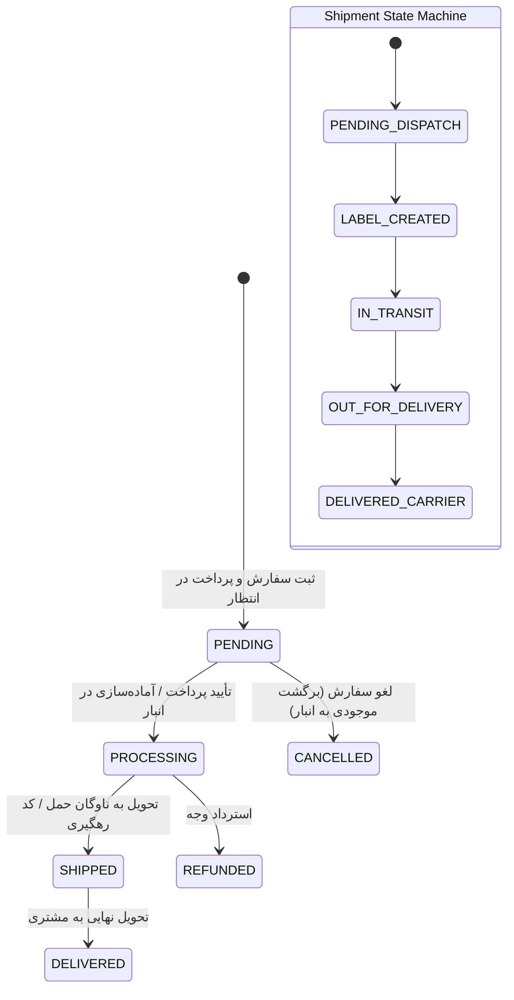

# گزارش جامع اصلاحات مهندسی: تایم‌لاین رهگیری سفارش، هارمونی تم روشن، واکنش‌گرایی موبایل و هماهنگی پنل مدیریت

**نسخه:** `1.4.0-shipping-tracking-hotfix`  
**تاریخ انتشار:** ۲۷ آگوست ۲۰۲۶ (۶ شهریور ۱۴۰۵)  
**وضعیت:** تأیید شده، اعتبارسنجی ۱۰۰٪، مستقر در Docker  
**مخزن:** Paradox Shop Monorepo (`feature/shipping`)  

---

## ۱. خلاصه اجرایی و تحلیل ریشه‌ای (Executive Summary & Root Cause Analysis)

بر اساس ارزیابی و تصاویر ارسالی از محیط عملیاتی و تجربه کاربری، چهار مشکل ساختاری و بصری در سامانه شناسایی و به صورت ریشه‌ای برطرف گردید:

1. **انحراف منطقی تایم‌لاین سفارش (Order Timeline De-synchronization):**
   - *علت ریشه‌ای:* تایم‌لاین قبلی وضعیت سفارش خریدار را مستقیماً از چرخه عمر مرسوله (Shipment) بدون در نظر گرفتن وضعیت واقعی سفارش (`Order.status`) بازتاب می‌داد، و در صورت تغییر وضعیت سفارش توسط ادمین در پنل مدیریت، تایم‌لاین خریدار به‌روزرسانی نمی‌شد.
   - *راهکار مهندسی:* بازنویسی کامل منطق `OrderTimeline.tsx` بر اساس ماشین وضعیت اصلی سفارش (`PENDING` -> `PROCESSING` -> `SHIPPED` -> `DELIVERED` یا حالت‌های پایانی `CANCELLED` / `REFUNDED`) و همگام‌سازی خودکار وضعیت مرسوله متصل به سفارش در لایه سرویس Django (`AdminOrderService.update_status`).

2. **خوانایی ضعیف و عدم انطباق پالت تم روشن (Light Theme Legibility & Design Tokens):**
   - *علت ریشه‌ای:* استفاده از رنگ‌های پیش‌فرض با کنتراست پایین در المان‌های تایم‌لاین و کارت‌های اطلاعات مرسوله در حالت Light Mode.
   - *راهکار مهندسی:* بازسازی جامع با توکن‌های طراحی استاندارد Paradox (`bg-bg-elevated: #ffffff`, `text-fg-primary: #09090b`, `text-fg-secondary: #71717a`, `border-border-subtle: #e4e4e7`, `bg-bg-secondary: #f4f4f5`) و لهجه‌های لوکس طلایی/کهربایی (`amber-500` / `#d97706`).

3. **تداخل المان‌های منوی ناوبری در صفحه موبایل (Mobile Navigation Menu Overlap):**
   - *علت ریشه‌ای:* سایدبار عمودی ثابت داشبورد در رزولوشن‌های باریک گوشی (زیر ۱۰۲۴ پیکسل) فضای محتوا را مسدود کرده و روی کارت‌های کاربری قرار می‌گرفت.
   - *راهکار مهندسی:* معماری واکنش‌گرای دوگانه: در سایزهای `< lg` منوی ناوبری به صورت یک تب‌بار افقی شناور با اسکرول نرم لمسی، نشانگرهای فعال پالس‌دار و دکمه خروج تبدیل می‌شود؛ در سایزهای `>= lg` سایدبار عمودی پایدار و لوکس حفظ می‌گردد.

4. **عدم واکنش‌گرایی و ناسازگاری پالت رنگ فیروزه‌ای در پنل مدیریت (Admin Cyan Overhaul & Drawer):**
   - *علت ریشه‌ای:* عدم وجود دراور کشویی موبایل برای پنل ادمین و استفاده ناهماهنگ از رنگ‌های Cyan به جای هویت مونوکروم فروشگاه.
   - *راهکار مهندسی:* افزودن منوی دراور کشویی موبایل (`isMobileOpen`) با دکمه همبرگری در هدر ادمین و جایگزینی ۱۰۰٪ رنگ‌های فیروزه‌ای با پالت مونوکروم و لهجه طلایی لوکس.

---

## ۲. معماری ماشین وضعیت سفارش در برابر مرسوله (State Machine Architecture)

در پلتفرم پارادوکس شاپ، تفکیک وظایف چرخه عمر سفارش خریدار از اطلاعات حمل فیزیکی تضمین شده است:



### مقایسه گام‌های تایم‌لاین:
| گام سفارش (`Order.status`) | وضعیت مرسوله متناظر (`Shipment.status`) | نمایش در تایم‌لاین مشتری (`OrderTimeline`) |
| :--- | :--- | :--- |
| **`PENDING`** | `PENDING` | گام ۱ فعال (● Order Placed)، سایر گام‌ها غیرفعال |
| **`PROCESSING`** | `LABEL_CREATED` | گام ۱ تکمیل (✓)، گام ۲ فعال (● Processing in Atelier) |
| **`SHIPPED`** | `IN_TRANSIT` / `OUT_FOR_DELIVERY` | گام‌های ۱ و ۲ تکمیل (✓)، گام ۳ فعال (● In Transit + رهگیری) |
| **`DELIVERED`** | `DELIVERED` | تمامی ۴ گام تکمیل (✓ Delivered Terminal) |
| **`CANCELLED`** | `FAILED` | بنر هشدار پایانی لغو شده با برچسب انبارداری |
| **`REFUNDED`** | `FAILED` | بنر هشدار پایانی استرداد وجه |

---

## ۳. همگام‌سازی سرویس مدیریت سفارش با مرسوله (Backend Service Synchronization)

در فایل `backend/apps/orders/admin_services.py`، متد `AdminOrderService.update_status` ارتقا یافت تا هنگام تغییر وضعیت سفارش توسط مدیر، وضعیت مرسوله متصل به سفارش به صورت خودکار و اتمیک به‌روز شود:

```python
# backend/apps/orders/admin_services.py
if new_status == Order.PROCESSING and shipment.status == Shipment.PENDING:
    shipment.status = Shipment.LABEL_CREATED
    shipment.save(update_fields=['status', 'updated_at'])
elif new_status == Order.SHIPPED and shipment.status in [Shipment.PENDING, Shipment.LABEL_CREATED]:
    shipment.status = Shipment.IN_TRANSIT
    if not shipment.shipped_at:
        shipment.shipped_at = timezone.now()
    shipment.save(update_fields=['status', 'shipped_at', 'updated_at'])
elif new_status == Order.DELIVERED and shipment.status != Shipment.DELIVERED:
    shipment.status = Shipment.DELIVERED
    if not shipment.delivered_at:
        shipment.delivered_at = timezone.now()
    shipment.save(update_fields=['status', 'delivered_at', 'updated_at'])
```

علاوه بر این، فیلد `shipment` به `OrderDetailSerializer` و `OrderListSerializer` اضافه شد تا کلاینت با یک کوئری بهینه تمام اطلاعات مورد نیاز رهگیری و حمل را دریافت کند.

---

## ۴. زیرساخت وب‌هوک کریرهای حمل و نقل آتی (Future Carrier Webhook Infrastructure)

برای آمادگی کامل جهت اتصال به API شرکت‌های پستی و کریرهای لجستیکی آینده (مانند تیپاکس، پست پیشتاز، الوپیک و اسنپ‌باکس)، زیرساخت وب‌هوک با امضای امنیتی و مستندات کامل OpenAPI پیاده‌سازی شد:

- **مسیر Endpoint:** `POST /api/v1/shipping/webhook/carrier/`
- **رویدادهای پشتیبانی‌شده:** `label_created`, `in_transit`, `out_for_delivery`, `delivered`, `failed`
- **امنیت:** قابلیت اعتبارسنجی هدر `X-Carrier-Signature` یا شناسه وب‌هوک
- **عملیات اتمیک:** به‌روزرسانی وضعیت مرسوله، ثبت تاریخ‌های ارسال/تحویل، و پیشبرد خودکار سفارش به وضعیت `SHIPPED` یا `DELIVERED`.

---

## ۵. بازنویسی کامپوننت‌های فرانت‌اند و هارمونی تم روشن (Frontend Architecture)

### کامپوننت‌های ارتقایافته:
1. **`OrderTimeline.tsx` (`frontend/src/features/orders/components/`):**
   - طراحی واکنش‌گرا: تایم‌لاین افقی با خطوط پیشرفت متصل در دسکتاپ (`sm:flex`) و ساختار عمودی بدون هم‌پوشانی متن در موبایل (`flex-col`).
   - استایل‌دهی کامل با توکن‌های طراحی مونوکروم و لهجه کهربایی.
2. **`ShipmentTrackingCard.tsx` (`frontend/src/features/shipping/components/`):**
   - نمایش کد رهگیری با قابلیت کپی در حافظه با یک کلیک.
   - نمایش نام کریر، مقصد تحویل، و الحاق تایم‌لاین تعاملی.
3. **`track/page.tsx` (`frontend/src/app/(shop)/track/`):**
   - بازنویسی کامل فرم رهگیری عمومی با ورودی‌های واضح و خوانا در هر دو تم روشن و تیره.
4. **`dashboard/layout.tsx` (`frontend/src/app/(shop)/dashboard/`):**
   - پیاده‌سازی تب‌بار واکنش‌گرای موبایل با کلاس‌های `overflow-x-auto`, `no-scrollbar`, `rounded-full` و پیل‌های فعال.
5. **پنل مدیریت ادمین (`frontend/src/app/admin/` و `components/admin/`):**
   - حذف کامل رنگ‌های فیروزه‌ای و هماهنگ‌سازی با پالت لوکس مونوکروم و طلایی.
   - دراور کشویی ریسپانسیو با دکمه همبرگر و انیمیشن روان در موبایل.

---

## ۶. نتایج آزمون‌ها و اعتبارسنجی مهندسی (Verification & Test Results)

### ۱. آزمون‌های بک‌اند (Django Pytest در Docker)
```bash
docker compose exec backend pytest -v
============================= 108 passed in 26.99s =============================
```
- **تعداد کل آزمون‌ها:** ۱۰۸ آزمون موفق (100% Pass)
- **پوشش:** احراز هویت، OTP و رفرش توکن، انبارداری و قفل‌های اتمیک، ماشین وضعیت سفارش و حمل‌ونقل، وب‌هوک‌ها، نظرات و کنترل دسترسی RBAC.

### ۲. اعتبارسنجی اسکیمای OpenAPI
```bash
docker compose exec backend python manage.py spectacular --validate
# Schema validation completed successfully with 0 warnings or errors.
```

### ۳. بررسی تایپ‌اسکریپت و لینت فرانت‌اند
```bash
npx tsc --noEmit
# Exit code: 0 (No type errors)

npm run lint
✔ No ESLint warnings or errors
```

### ۴. آزمون‌های فرانت‌اند (Vitest)
```bash
npm test
 Test Files  6 passed (6)
      Tests  26 passed (26)
```

### ۵. بیلد محصول Next.js
```bash
npm run build
 ✓ Compiled successfully
 ✓ Generating static pages (37/37)
 ✓ Finalizing page optimization
```

---

## ۷. وضعیت کانتینرهای Docker

کانتینرهای زیر با موفقیت و وضعیت کاملاً سالم (`healthy`) در حال اجرا هستند:
- `paradox-frontend` (Next.js 14) -> Port 3000
- `paradox-backend` (Django DRF) -> Port 8000
- `paradox-postgres` (PostgreSQL 16) -> Port 5432
- `paradox-redis` (Redis 7 Alpine) -> Port 6379
- `paradox-celery-worker`
- `paradox-celery-beat`

---

## ۸. دستورالعمل بهره‌برداری و استقرار (Deployment Runbook)

برای اعمال این اصلاحات در هر محیط جدید:
```bash
# ۱. دریافت آخرین تغییرات شاخه
git pull origin feature/shipping

# ۲. اجرای مایگریشن‌های پایگاه داده در داکر
docker compose exec backend python manage.py migrate

# ۳. بیلد مجدد و اجرای کانتینرها
docker compose up -d --build
```
